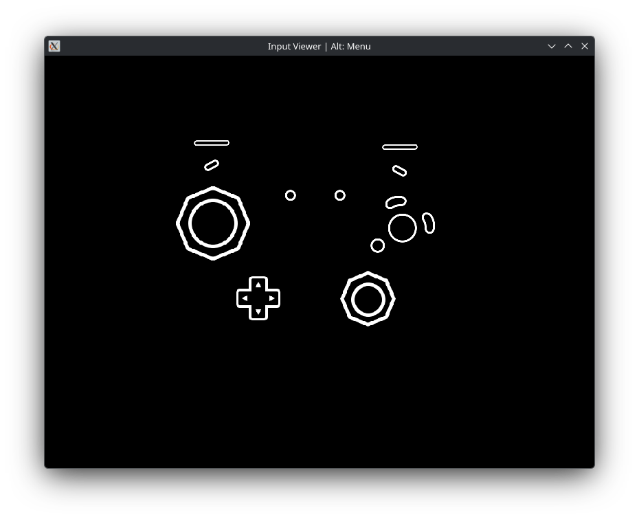
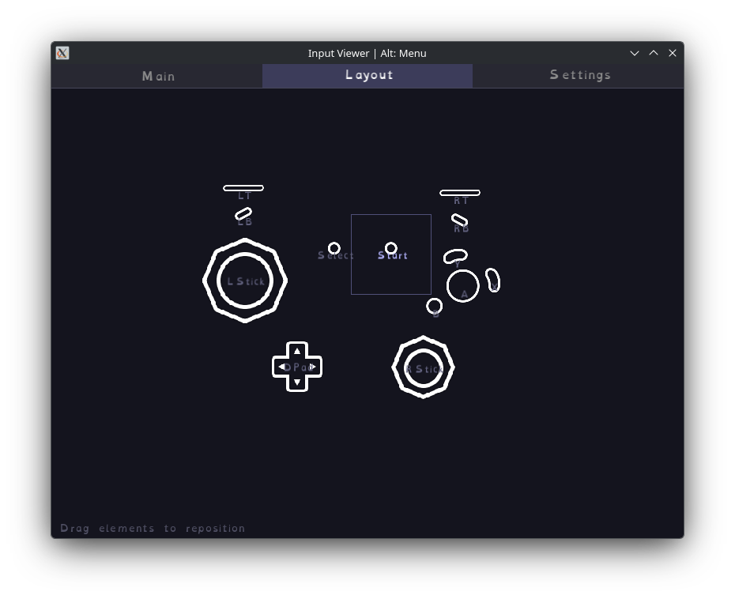
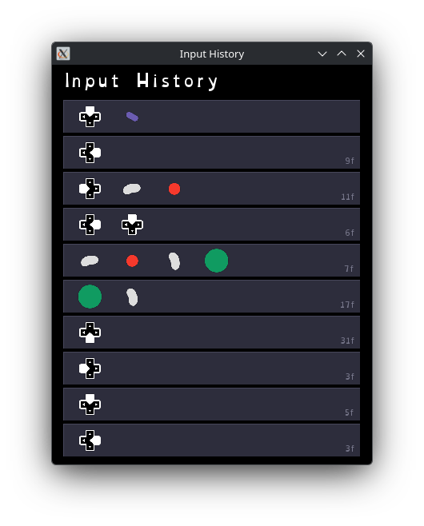
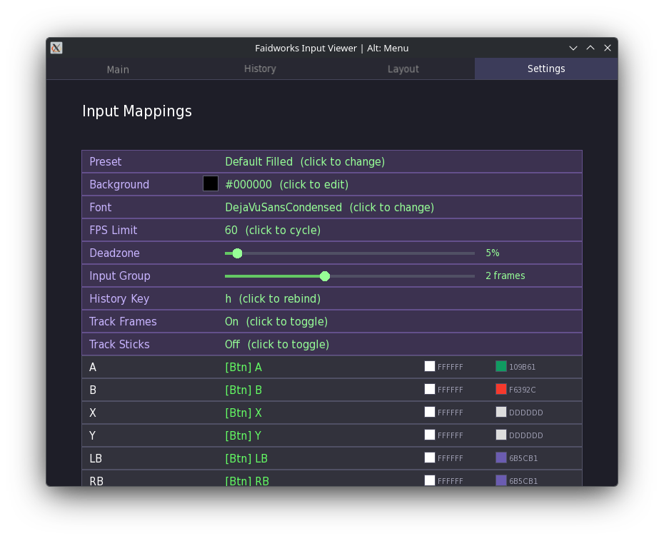

# Faidworks Input Viewer

A native gamepad input viewer built with SFML and SDL3. Displays controller inputs in real time with customizable button layouts, colors, and fonts.

## Building

Requires CMake 3.10+. Dependencies (SFML 3, SDL3) are fetched automatically via CMake FetchContent.

### Linux

```sh
chmod +x ./build.sh
./build.sh
```

### Windows

Run from a Visual Studio Developer Command Prompt:

```bat
build-win.bat
```

Produces a statically linked exe at `build_win\src\Release\faidworks-input-viewer.exe` with no external DLL dependencies.

## Usage

Press **Alt** to toggle the navigation bar and switch between tabs.

### Main

Displays controller inputs in real time. Buttons light up with their configured active color when pressed, and triggers show analog fill.



### Layout

Drag elements to reposition them. The layout is saved automatically on exit.



### History

Shows a scrolling log of recent inputs with frame durations. Each row displays which buttons were held and how long since the previous input.



### Settings

Configure input mappings, background color, per-button colors, font, and presets.



#### Presets

Presets bundle button images and layout positions together under a name. Each preset has exactly two image types: **inactive** (shown when not pressed) and **active** (shown when pressed). Two built-in presets ship by default: "Default Filled" and "Default Pressed".

Click the **Preset** row in settings to open the preset picker, where you can switch, create, or delete presets.

Each preset is stored as a subfolder under the config directory:

```
presets/
  Default Filled/
    preset.txt
    layout.txt
  Default Pressed/
    preset.txt
    layout.txt
  MyTheme/
    preset.txt
    layout.txt
```

**Custom images via folder:** To use custom button images, click your active preset in the picker and type a folder path into the **Images** field. The folder should contain two subfolders, `inactive/` and `active/`, with PNG files using these names:

```
inactive/                   active/
  a.png                       a.png
  b.png                       b.png
  x.png                       x.png
  y.png                       y.png
  lb.png                      lb.png
  rb.png                      rb.png
  lt.png                      lt.png
  rt.png                      rt.png
  start.png                   start.png
  select.png                  select.png
  d-pad-gate.png              d-pad-gate.png
                              d-pad-up.png
                              d-pad-down.png
                              d-pad-left.png
                              d-pad-right.png
  joystick-gate.png           joystick-gate.png
  joystick.png                joystick.png
  joystick-ribs.png           joystick-ribs.png
  c-stick-gate.png            c-stick-gate.png
  c-stick.png                 c-stick.png
  c-stick-ribs.png            c-stick-ribs.png
```

Any missing files fall back to the built-in images. You can also set per-element overrides in `preset.txt` using `_override_<key>=<path>` (e.g., `_override_a-active=/path/to/custom-a.png`).

## Configuration

Settings are stored in `~/.config/faidworks-input-viewer/` (Linux), `~/Library/Application Support/faidworks-input-viewer/` (macOS), or `%APPDATA%/FaidworksInputViewer/` (Windows).
